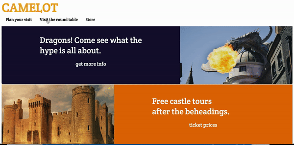

# The Camelot experience
 
The camelot experience is supposed to simulate a website for family vacations. However, it is set in the fictional Camelot. 
It mimics the excursion family ticket prices i.e the zoo, museums, etc. 
### The Technologies
I used equal parts html and css for this project. A little javascript used as well. The animations were done in css via keyframes and scale. The site is primarily flexbox. 
The changing of the colors on the title and when you hover over a specific clickable portion of the page was all done in css. The buttons on the nav bar also change size when you hover over them. 
I also made the nav bar fixed so whenever you scroll down the page, the nav bar follows you. I did this in css. 
The event handlers(clicks) I did in javascript. I also was able to create the modal in html and css. The functionality is javascript.
